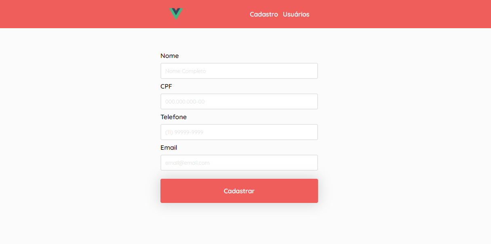

<br />
<p align="center">
  
  <h3 align="center">Cadastro VueJS</h3>

  <p align="center">
    Um simples aplicativo de cadastro de usuários
    <br />
    <a href="https://leticiafrontend.github.io/register-vue/"><strong>Veja o site online »</strong></a>
    <br />
    <br />
  </p>
</p>

## 📌 Índice

- [Sobre o projeto](#sobre-o-projeto)
  - [Feito com](#feito-com)
- [Iniciando o projeto](#iniciando-o-projeto)
  - [Pré-requisitos](#requisitos-minimos)
  - [Instalação](#instalacao)
- [License](#license)
- [Contato](#contato)

## 💻 Sobre o projeto

<p align="center">
  
</p>
<br>

<p>Esse projeto é um simples aplicativo de cadastro de usuários, nele contém duas páginas "Cadastro" e "Usuários", na página de cadastro é possível cadastrar um usuário novo e automáticamente ele é listado na página de usuários, e o dados ficam salvos no `localStorage`, e na página de usuários é possível ver os usuários cadastrados e também tem a opção de apagar o usuário.</p>

### 📝 Feito com

- [JavaScript ES6](http://es6-features.org/)
- [VueJS](https://vuejs.org/)
- [Vue Router](https://router.vuejs.org/)

## 🎉 Iniciando o projeto

Para clonar e instalar o projeto em sua máquina, siga os passos abaixo.

### ❗ Pré-requisitos <a name="requisitos-minimos"></a>

Para rodar o projeto é necessário ter o <a href="https://nodejs.org/en/download/">Node</a> instalado na sua máquina.

### 📥 Instalação <a name="instalacao"></a>

1. Clone o repositório

```sh
git clone https://github.com/leticiafrontend/register-vue.git
```

2. Instale as dependências rodando o comando

```sh
npm install
```

3. Digite o comando para ligar o servidor

```JS
npm run serve
```

4. Acesse a URL http://localhost:8080/

## 📱 Contato <a name="contato"></a>

Letícia Silva - [LinkedIn](https://www.linkedin.com/in/leticia-alexandre/) - leticia.alesilva@outlook.com - [WhatsApp](https://api.whatsapp.com/send?phone=5511940106659)

Outros projetos: [https://github.com/leticiafrontend/](https://github.com/leticiafrontend/)
<br>
<br><br>
